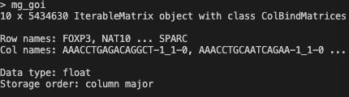

# scFraction: An ultra-fast study of gene expressed fraction of large-scale count matrix with BPCells

<p align="center">
  
</p>


## scFraction analysis methods

This project covers 5 levels of fraction analysis based on BPCells-scRNA-seq count matrix. The fraction definition here is based on the number of above-threshold dividied by the overall number of cell of every accession and such fraction can also be grouped by celltype and disease information. 


## Basic Usage

First calculate the fraction table, all visualization methods are based on this fraction table.

```R
frac_table <- fraction_accCT_table(mg_goi, mg_meta = meta, goi = rownames(mg_goi), threshold = 0.5)
```

With `fraction_accCT_table`, you can even calculation 5M-cell fraction within several minutes.
<p align="center">
  
</p>

Five levels of visualization:
1. `Level0`:
   - `BPCells_global_feature` calculates the average expression and the percentage of cells with expression above a certain threshold for each gene of interest (goi) in each cell type group. 
2. `Level1`:
   - `gene_ct_fraction_plot` creates a Dot plot for each gene of interest (goi) showing the mean expression fraction and the number of cells expressing the gene in each cell type.
3. `Level2`:
   - `acc_ct_dotplot` creates a Dot plot for a specific cell type of interest (ctoi) showing the expression fraction and the number of cells expressing each gene of interest (goi) in each accession.
4. `Level3`:
   - `acc_ct_Diff_frac` creates a Dot plot for each gene of interest (goi) showing the differential expression fraction and the difference in the number of cells expressing the gene between two diseases in each cell type.
5. `Level4`:
   - `fraction_Barplot` creates a bar plot for each gene of interest (goi) showing the expression fraction in each cell type for a specific parameter (e.g., disease).
6. `Level5`:
   - `corr_fraction_plot` creates a scatter plot for each gene of interest (goi) showing the correlation of expression fractions between two parameters (e.g., diseases) in each cell type.

```R
meta$groups <- meta$disease
gene_cluster <- BPCells_global_feature(mg_goi, global_meta = meta, goi = rownames(mg_goi), threshold = 0.5)
feature_dotplot(gene_cluster, goi = c("Ddr2", "Lamc2"), output_dir)
```

```R
p <- gene_ct_fraction_plot(frac_table, goi = rownames(mg_goi))
p_title <- paste0(output_dir, "global_acc_ct_dotplot.png")
ggsave(filename = p_title,
    plot = p, width = 8, height = 18, units = "in")
```

```R
ctoi <- "Astro"
p <- acc_ct_dotplot(tmp, goi, ctoi = ctoi)
p_title <- paste0(output_dir, ctoi, "_ct_acc_dotplot.png")
ggsave(filename = p_title,
    plot = p, width = 20, height = 8, units = "in")
```

```R
p <- acc_ct_Diff_frac(frac_table, goi, groupby = 'celltype')
p_title <- paste0(output_dir, "def_dotplot.png")
ggsave(filename = p_title,
    plot = p, width = 28, height = 8, units = "in")
```


## conda environment Setup and Installation

Main conda environments are required:

- BPCells:
    1. conda install: prepare `BPCells` environment via `BPCell_ENV.yaml`
    2. extra pip install: `BPCells_requirements.txt`
    3. install `BPCells`

```R
remotes::install_github("bnprks/BPCells")
```

```R
library(devtools) # If not installed: install.packages('devtools')
library(remotes)  #If not installed: install.packages('remotes')
remotes::install_github("drieslab/Giotto@master")
```

## Large-scale Data Storage and Performance Efficiency

PulmoScope hosts over 5 million metadata harmonized scRNA-seq data from over 1,100 human samples across 20 disease conditions. Implemented with BPCells integration and Bit-packing compression techniques, the overall 5 million scRNA-seq data requires less than 50GB storage space with an average open time of 0.344 seconds for every 1,000,000 cells data object.
## [Learn more at our web server](http://www.gzlb.miracle.ac.cn:9800/PulmoScope/home)